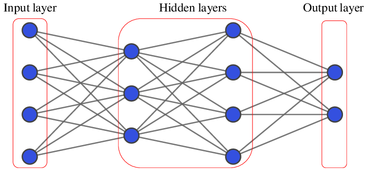

# Customer Churn Prediction

This project focuses on customer churn prediction using a **Feed-Forward Neural Network (FFN)** for binary classification. The model evaluates various network architectures, activation functions, and optimizers to identify the most efficient and accurate configuration for predicting customer churn.

## Project Structure

- **Churn_Prediction.ipynb**: Jupyter Notebook containing the code implementation for data preprocessing, model training, and evaluation.
- **Churn_Prediction_Report.pdf**: A detailed report explaining the project methodology, data preprocessing steps, model configurations, and results.

## Introduction

Customer churn prediction helps businesses retain valuable clients by identifying potential churners and mitigating risks. The goal of this project is to:

1. Develop and train FFN models.
2. Experiment with different hyperparameters and configurations.
3. Compare performance metrics such as accuracy, precision, recall, and F1 score.

## Dataset Overview

The dataset contains information on 10,000 customers with 18 features, including:

- **Demographics**: Age, Gender, Geography.
- **Account Details**: Credit Score, Balance, Tenure, Number of Products.
- **Behavioral Metrics**: Satisfaction Score, Active Member Status, Complaints, and more.

### Data Preprocessing

- **Feature Selection**: Removed irrelevant columns (`RowNumber`, `CustomerId`, `Surname`).
- **Encoding**: Converted categorical variables (`Geography`, `Gender`, `Card Type`) into numerical format using One-Hot Encoding.
- **Normalization**: Scaled numerical features using `MinMaxScaler`.
- **Splitting**: Divided the data into training (60%), validation (20%), and testing (20%) sets.

## Model Overview

### Architecture

1. **Input Layer**: 20 neurons for key features.
2. **Hidden Layers**: Evaluated configurations with 1 or 2 layers, each with 200 neurons.
   - Activation Functions: ReLU and Leaky ReLU.
3. **Output Layer**: 1 neuron with sigmoid activation for binary classification.

### Optimization Techniques

- **Loss Function**: Binary Cross-Entropy Loss.
- **Regularization**: Dropout (20%) to prevent overfitting.
- **Optimizers**: Momentum SGD and Adam.

### Training Protocol

- Early stopping to prevent overfitting, halting training after 5 epochs without improvement.
- Maximum epochs: 10,000.

## Results

- Baseline model achieved:
  - Accuracy: 99.85%
  - Precision: 99.52%
  - Recall: 99.76%
  - F1 Score: 99.64%
- Models performed consistently across configurations, with efficiency varying based on:
  - Learning rate
  - Activation functions
  - Optimizers

| Hidden Layers | Learning Rate | Optimizer | Activation | Epochs | Accuracy | Precision | Recall | F1   |
|---------------|---------------|-----------|------------|--------|----------|-----------|--------|-------|
| 1             | 0.01          | Momentum  | ReLU       | 4714   | 0.9985   | 0.9952    | 0.9976 | 0.9964 |
| 1             | 0.05          | Momentum  | ReLU       | 61     | 0.9985   | 0.9952    | 0.9976 | 0.9964 |
| 2             | 0.01          | Momentum  | ReLU       | 656    | 0.9985   | 0.9952    | 0.9976 | 0.9964 |
| 1             | 0.01          | Momentum  | Leaky ReLU | 2678   | 0.9985   | 0.9952    | 0.9976 | 0.9964 |
| 1             | 0.001         | Adam      | ReLU       | 430    | 0.9985   | 0.9952    | 0.9976 | 0.9964 |

## Conclusion

The FFN models exhibited robust and consistent performance, achieving high accuracy and precision. The key findings are:

- Configuration impacts training efficiency more than accuracy.
- Optimizers and learning rates significantly influence convergence speed.
- Dropout and early stopping effectively prevent overfitting.

## Requirements

- Python 3.8+
- Libraries: PyTorch, NumPy, Pandas, Matplotlib, Scikit-learn, Seaborn

## Usage

1. Clone the repository.
2. Open `Churn_Prediction.ipynb` in Jupyter Notebook.
3. Follow the code for data preprocessing, model training, and evaluation.

## Author

**Seunghyun Park**

For more details, refer to the full report: [Churn_Prediction_Report.pdf](./Churn_Prediction_Report.pdf).
